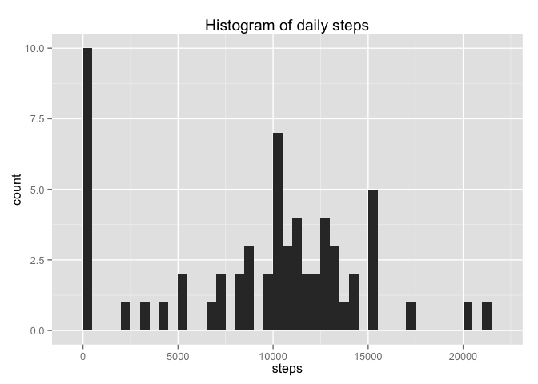
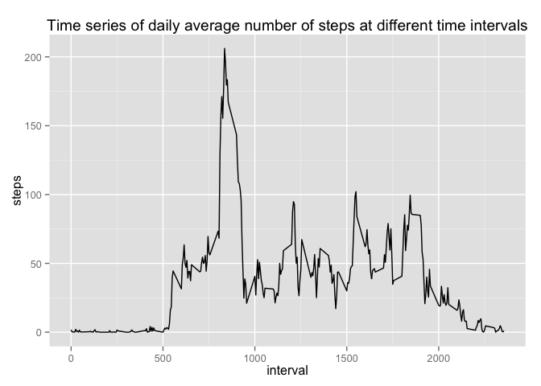
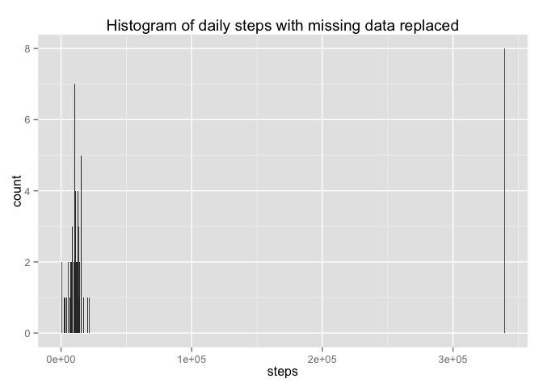
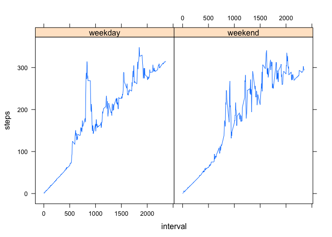

# Reproducible Research: Peer Assessment 1

## Loading and preprocessing the data

The first step is to load in the data, and make sure the date column in represented as a date. The column names of this data frame are "steps", "date", and "interval". The code chunk below will show the first few lines of data.

```r
data <- read.csv("activity.csv")
data[,2] <- as.Date(data[,2])
head(data)
```

```
##   steps       date interval
## 1    NA 2012-10-01        0
## 2    NA 2012-10-01        5
## 3    NA 2012-10-01       10
## 4    NA 2012-10-01       15
## 5    NA 2012-10-01       20
## 6    NA 2012-10-01       25
```

## What is mean total number of steps taken per day?

First we want to find the total nuber of steps taken each day: 

```r
library(plyr)
stepsPerDay <-ddply(data, "date", numcolwise(sum),na.rm=TRUE)[,-3]
stepsPerDay
```

```
##          date steps
## 1  2012-10-01     0
## 2  2012-10-02   126
## 3  2012-10-03 11352
## 4  2012-10-04 12116
## 5  2012-10-05 13294
## 6  2012-10-06 15420
## 7  2012-10-07 11015
## 8  2012-10-08     0
## 9  2012-10-09 12811
## 10 2012-10-10  9900
## 11 2012-10-11 10304
## 12 2012-10-12 17382
## 13 2012-10-13 12426
## 14 2012-10-14 15098
## 15 2012-10-15 10139
## 16 2012-10-16 15084
## 17 2012-10-17 13452
## 18 2012-10-18 10056
## 19 2012-10-19 11829
## 20 2012-10-20 10395
## 21 2012-10-21  8821
## 22 2012-10-22 13460
## 23 2012-10-23  8918
## 24 2012-10-24  8355
## 25 2012-10-25  2492
## 26 2012-10-26  6778
## 27 2012-10-27 10119
## 28 2012-10-28 11458
## 29 2012-10-29  5018
## 30 2012-10-30  9819
## 31 2012-10-31 15414
## 32 2012-11-01     0
## 33 2012-11-02 10600
## 34 2012-11-03 10571
## 35 2012-11-04     0
## 36 2012-11-05 10439
## 37 2012-11-06  8334
## 38 2012-11-07 12883
## 39 2012-11-08  3219
## 40 2012-11-09     0
## 41 2012-11-10     0
## 42 2012-11-11 12608
## 43 2012-11-12 10765
## 44 2012-11-13  7336
## 45 2012-11-14     0
## 46 2012-11-15    41
## 47 2012-11-16  5441
## 48 2012-11-17 14339
## 49 2012-11-18 15110
## 50 2012-11-19  8841
## 51 2012-11-20  4472
## 52 2012-11-21 12787
## 53 2012-11-22 20427
## 54 2012-11-23 21194
## 55 2012-11-24 14478
## 56 2012-11-25 11834
## 57 2012-11-26 11162
## 58 2012-11-27 13646
## 59 2012-11-28 10183
## 60 2012-11-29  7047
## 61 2012-11-30     0
```

Next, produce a histogram of this activity:

```r
library(ggplot2)
qplot(steps,data=stepsPerDay,binwidth = 500,geom="histogram",main="Histogram of daily steps")
```

 

```r
meanSteps <- mean(stepsPerDay[,2])
medianSteps <- median(stepsPerDay[,2])
```
The mean number of steps per day is 9354.2295082. The median number of steps per day is 10395.

## What is the average daily activity pattern?

Next we want to look at the average number of steps for each interval across all days.

```r
stepsPerInterval <- ddply(data, "interval", numcolwise(mean),na.rm=TRUE)
qplot(y=steps,x=interval, data=stepsPerInterval, geom="path", main="Time series of daily average number of steps at different time intervals")
```

 


```r
maxInterval <- stepsPerInterval[which(stepsPerInterval[,2]==max(stepsPerInterval[,2])),1]
```

The time interval with the maximum average number of steps across all days is 835.

## Imputing missing values


```r
missing <- sum(is.na(data[,1]))
```
There are a total of 2304 missing values in the data set. We will fill in all missing data with the mean value for that time interval, and examine the effect.

```r
dataReplaced <- data
for (i in 1:dim(dataReplaced)[1]){
  if (is.na(dataReplaced[i,1])) {
    dataReplaced[i,1] <- stepsPerInterval[which(stepsPerInterval$interval==dataReplaced[i,3]),1]
  }
}
```
Below is a histogram of the new data set with missing values filled in:

```r
stepsPerDayReplaced <-ddply(dataReplaced, "date", numcolwise(sum),na.rm=TRUE)[,-3]
qplot(steps,data=stepsPerDayReplaced,binwidth = 500,geom="histogram",main="Histogram of daily steps with missing data replaced")
```

 

```r
maxReplaced <- max(stepsPerDayReplaced$steps)
meanReplaced <- mean(stepsPerDayReplaced$steps)
medianReplaced <- median(stepsPerDayReplaced$steps)
```
The new mean number of steps per day is 5.3828984\times 10^{4}. The new median is 11458. These are both higher than the values from the data set with missing values. The most obvious effect of replacing the missing values was that all the days with entirely missing data showed up on the histogram with a much higher count than any other number of steps (339120), which was the sum of all the replaced NAs.

## Are there differences in activity patterns between weekdays and weekends?
The following plot shows the daily average number of steps over the time intervals for weekends versus weekdays.

```r
day <- function(x) {ifelse(weekdays(x)=="Saturday"|weekdays(x)=="Sunday","weekend","weekday")}
dataReplaced$day <- sapply(dataReplaced$date,day)
averages <- ddply(dataReplaced, .(interval,day), numcolwise(mean))
library(lattice)
xyplot(steps~interval|day,data=averages,type='l')
```

 
